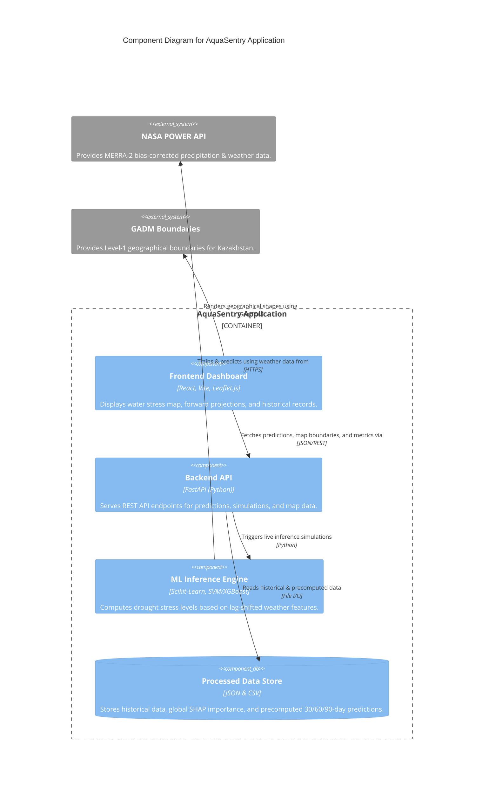

# C4 Component Level: AquaSentry Architecture

This document breaks down the major logical components of the AquaSentry application, describing their interfaces and relationships.

## System Components

### 1. Frontend Dashboard
- **Name**: Interactive React Map & HUD
- **Description**: A Vite+React single-page application integrating Leaflet.js to render regional drought stress maps of Kazakhstan. Features an interactive cyberpunk-styled HUD for overriding climate variables and running on-the-fly predictions.
- **Technologies**: React, Vite, Leaflet.js, CSS3.

### 2. Backend API
- **Name**: FastAPI Python Service
- **Description**: RESTful API acting as the bridge between the frontend dashboard and the data/ML models. It serves cached historical data, baseline predictions, model evaluation metrics, and SHAP explainability matrices.
- **Technologies**: Python, FastAPI, Uvicorn, Pydantic.

### 3. ML Inference Engine
- **Name**: AquaSentry Predictive Engine
- **Description**: Responsible for processing historical satellite features and executing inferences to predict drought stress on a 30, 60, and 90-day horizon. Validated using cross-validation over an AutoML suite (XGBoost, SVM, LightGBM, RandomForest), ultimately utilizing SVM.
- **Technologies**: Scikit-Learn, Pandas, NumPy, Joblib.

### 4. Processed Data Store
- **Name**: File-based Knowledge Base
- **Description**: Stored processed data records derived from the NASA POWER API. Contains JSON mapping of SHAP values, cached prediction outputs, cross-validation scoring arrays, and pre-computed features (lagged/rolling z-scores).
- **Technologies**: JSON, CSV.

## Component Relationships Diagram

## External Interfaces

### NASA POWER API
- **Protocol**: HTTPS (REST)
- **Description**: Serves historical MERRA-2 meteorological and precipitation records for Kazakhstan.
- **Operations**:
  - `GET /api/temporal/monthly/point` - Retrieves monthly precipitation measurements for a target oblast.

### GADM Boundaries
- **Protocol**: Static GeoJSON
- **Description**: Provides accurate geographic bounding polygons for the 14 oblasts of Kazakhstan.
- **Operations**:
  - `Load geometry` - Used by the frontend map layer to map predictions visually onto spatial regions.
