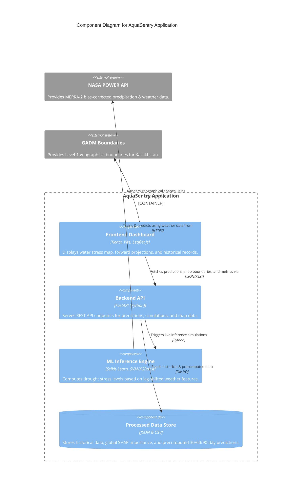

<div align="center">
  <h1>🌊 AquaSentry</h1>
  <p><strong>AI-Powered Regional Water Stress Forecaster for Kazakhstan</strong></p>
  <p><em>SmartEarth 2026 Hackathon | Nazarbayev University, Kazakhstan</em></p>

  <div>
    
    
    
    
    
  </div>
  <br/>
  <div>
    
    
  </div>
  <br/>
  <h3>🚀 <a href="https://gleeful-hamster-c986a6.netlify.app/">Try the Live Dashboard Here</a></h3>
</div>

---

## 🌍 What It Does & Why It Matters

**AquaSentry** predicts district-level water stress 30–90 days in advance for Kazakhstan using satellite climate data and machine learning. 

**Equity-First Approach:** Water scarcity disproportionately affects rural agricultural communities. By providing highly localized, early-warning stress predictions, AquaSentry enables decision-makers to equitably coordinate regional water allocation, proactively activate drought reserves, and protect the livelihoods of local farmers before a crisis hits.

---

## 🏗️ Architecture & C4 Component Diagram

Here is a C4 Component Diagram illustrating how AquaSentry processes NASA satellite data, generates AI predictions, and serves them to the frontend dashboard. For a detailed breakdown, please see the [C4 Architecture Documentation](C4_ARCHITECTURE.md).



---

## 📈 Model Performance

- **Train accuracy (2015–2022):** 96.6%
- **Test accuracy (2023–2024):** 87.5%
- **Test F1-Score:** 87.1%
- **Class Balancing:** SMOTE applied on the training set to combat class imbalance.
- **Explainability:** SHAP global importance calculated to identify primary drought drivers.
- **Backtested on 2021 Central Asian Drought** — correctly flagged Warning/Emergency for southern oblasts (Yujno-kazachstanskaya, Jambylslkaya, Almatinskaya) during 2021.

> **Note:** 87.5% test accuracy with **no data leakage** — all 13 features are temporally lagged by 1–2 months to ensure genuine forecasting.

---

## 📊 Drought Stress Levels

| Level | Composite Z-Score Threshold | Action Required | Color Indicator |
|-------|-----------------------------|-----------------|-----------------|
| **Normal** | > −0.3 | None | 🟢 `#2ecc71` |
| **Watch** | −0.3 to −0.6 | Monitor localized dry conditions | 🟡 `#f39c12` |
| **Warning** | −0.6 to −0.9 | Prepare to activate drought reserves | 🟠 `#e67e22` |
| **Emergency**| < −0.9 | Enact immediate water allocation protocols | 🔴 `#e74c3c` |

---

## 🧬 Features Used (13 Features)

To prevent data leakage, **all features are lag-shifted**:
1. `month_sin` / `month_cos` — Cyclical seasonal position
2. `rain_z_lag1`, `rain_z_lag2` — Rainfall Z-score 1-2 months prior
3. `temp_z_lag1`, `temp_z_lag2` — Temperature Z-score 1-2 months prior
4. `soil_z_lag1`, `soil_z_lag2` — Soil Moisture Z-score 1-2 months prior
5. `rain_z_roll3`, `temp_z_roll3`, `soil_z_roll3` — 3-month rolling averages of lagged anomalies
6. `rain_z_trend` — Direction of rainfall change (lag1 − lag2)
7. `roll3_lag1` — Previous month's 3-month rolling composite anomaly

---

## 🚀 Getting Started (Local Development)

### Prerequisites
- **Node.js** 18+
- **Python** 3.9+
- **Git**

### 1. Clone the Repository
```bash
git clone https://github.com/1nt24me020kotresh-alt/AquaSentry.git
cd AquaSentry
```

### 2. Start the Application (One-Click)
We provide a convenient bash script that boots both the FastAPI backend and React frontend simultaneously.
```bash
chmod +x start.sh
./start.sh
```

**Alternatively, you can run them manually:**

#### Backend (Terminal 1)
```bash
cd backend
pip install -r requirements.txt
uvicorn main:app --reload
```
*API runs at `https://aquasentry-awy8.onrender.com/`*

#### Frontend (Terminal 2)
```bash
cd frontend
npm install
npm run dev
```
*Dashboard runs at `https://gleeful-hamster-c986a6.netlify.app/`*

---

## 👥 The Team
- **Kotresh** — ML & Data Engineering (Satellite data pipeline + ML models)
- **Shreeya Attri** — Frontend & Backend (React dashboard + FastAPI architecture)
- **Zainaba Nargis Shah** — Research, Strategy & Pitch

---

